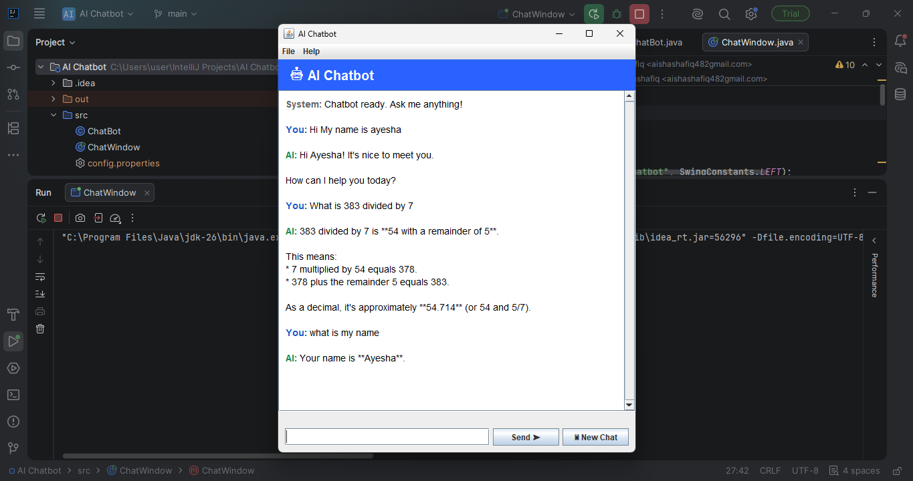

# 🤖 AI Chatbot with Memory (Java + Gemini API)

A desktop AI chatbot built in Java that maintains conversational memory across a session, powered by Google's Gemini API. Features a custom Swing GUI, robust error handling, and automatic conversation history management.


---

## 📋 Overview

Unlike a simple API wrapper, this chatbot maintains **conversational context** — it remembers what was said earlier in the session and factors that into every new response, just like ChatGPT or Gemini's own web interface. This is achieved entirely on the client side: the Gemini API itself is stateless, so the application resends the full (trimmed) conversation history with every request.

The project was built incrementally to reinforce core software engineering concepts: API integration, JSON serialization, HTTP networking, state management, GUI threading, and defensive error handling.

---

## ✨ Features

- **Conversational memory** — maintains context across multiple exchanges using an in-memory history list
- **Automatic history trimming** — caps the conversation window to prevent unbounded growth in token usage and cost
- **Custom Swing GUI** — color-coded chat bubbles, a live status indicator, menu bar, and a "New Chat" reset function
- **Non-blocking network calls** — API requests run on a background thread (`SwingWorker`) so the interface never freezes while waiting for a response
- **Graceful error handling** — connection failures, timeouts, and API errors surface as readable messages instead of crashing the app
- **Secure key management** — the API key is stored in a local `config.properties` file, excluded from version control via `.gitignore`

---

## 🖥️ Screenshots



## 🛠️ Tech Stack

| Component        | Choice                          |
|-------------------|----------------------------------|
| Language          | Java 17+ (developed on Java 25)  |
| GUI Framework     | Java Swing                       |
| JSON Handling     | [Gson](https://github.com/google/gson) 2.10.1 |
| Networking        | Java's built-in `HttpClient`     |
| AI Model          | Google Gemini `gemini-2.5-flash` |
| IDE               | IntelliJ IDEA                    |

---

## 🏗️ Architecture

The project follows a clean separation between **logic** and **interface**, so the same chatbot engine could be reused behind a console, a GUI, or even a web frontend without modification.

```
AIChatBot/
│
├── src/
│   ├── Message.java         # Data model for a single chat turn (role + text)
│   ├── ChatBot.java         # Core logic: memory, JSON building, API calls, error handling
│   ├── ChatWindow.java      # Swing GUI (chat display, input, buttons, menu bar)
│   ├── Main.java            # Console entry point (alternative to the GUI)
│   └── config.properties    # Local API key storage (not committed to Git)
│
└── README.md
```

**Key design decisions:**

- `ChatBot` has no knowledge of *how* it's being used — it exposes a simple `sendMessage(String)` method. This meant converting from a console interface to a full GUI required zero changes to the underlying chatbot logic.
- Conversation history is stored as an `ArrayList<Message>` and resent in full (up to a capped limit) on every request, since the Gemini API does not retain state between calls.
- All network and JSON errors are caught inside `ChatBot`, so calling code always receives a usable string response rather than having to handle exceptions itself.

---

## 🚀 Getting Started

### Prerequisites

- Java 17 or later installed (`java -version` to check)
- IntelliJ IDEA (or any Java IDE)
- A free [Google Gemini API key](https://aistudio.google.com/app/apikey)

### Setup

1. **Clone the repository**
   ```bash
   git clone https://github.com/your-username/AIChatBot.git
   cd AIChatBot
   ```

2. **Add the Gson library**
   Add Gson 2.10.1 as a dependency via your IDE (File → Project Structure → Libraries → From Maven → `com.google.code.gson:gson:2.10.1`), or via Maven/Gradle if you've converted the project to use a build tool.

3. **Configure your API key**
   Create a file at `src/config.properties`:
   ```properties
   GEMINI_API_KEY=your_api_key_here
   ```
   This file is excluded from version control via `.gitignore` — never commit real API keys.

4. **Run the application**
   - For the GUI: run `ChatWindow.java`
   - For the console version: run `Main.java`

---

## 🧠 How the Memory Works

```
User types a message
        │
        ▼
Message is added to an ArrayList<Message>
        │
        ▼
Oldest messages are trimmed if history exceeds the cap
        │
        ▼
Entire remaining history is serialized to JSON
        │
        ▼
Sent to Gemini API in one request
        │
        ▼
Gemini's reply is parsed and added back into the ArrayList
        │
        ▼
Displayed in the chat window
```

This client-side history management is what makes the bot feel like it "remembers" earlier parts of the conversation, even though each API call is technically independent.

---

## 🔒 Security Notes

- API keys are never hardcoded — they're loaded at runtime from `config.properties`
- `.gitignore` excludes `config.properties` to prevent accidental key leaks
- If you fork this project, generate your own API key rather than reusing anyone else's

---

## 📈 Possible Future Improvements

- [ ] Persist conversation history to disk (so it survives app restarts)
- [ ] Add streaming responses (token-by-token display instead of waiting for the full reply)
- [ ] Support multiple conversation tabs/sessions
- [ ] Add unit tests for `ChatBot`'s JSON building and parsing logic
- [ ] Package as a standalone executable (`.jar` or `.exe`) for easier distribution

---

## 📄 License

This project is open source and available under the [MIT License](LICENSE).

---

## 🙋 Author

Built by Ayesha as a hands-on learning project covering API integration, JSON handling, HTTP networking, and Java GUI development.
